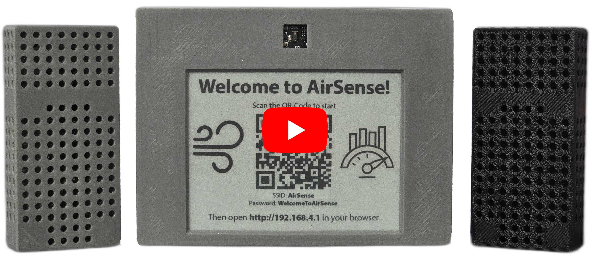

# AirSense

AirSense is an intelligent indoor and outdoor air quality monitoring system designed to help improve indoor air quality. By automatically measuring and transmitting the current air quality data, the user can analyze the current data. Smart triggers are also available, which trigger an action if self-defined limit values are exceeded.

The system consists of a base station with an e-ink display that can be operated using gestures. There are also external stations that are only used for measurement. The data is sent encrypted via https to a backend and can be analysed via a frontend.

An Alexa skill is also available to easily query the data by voice.

For an overview of the features, watch the YouTube video below.

Base Station Inside | External Station Inside
:-------------------------:|:-------------------------:
  |  

## Links
- [Firmware](firmware)
- [Schematics and housing](build)
- [Front- and Backend](web_console)
- [Alexa Skill](alexa_skill)
