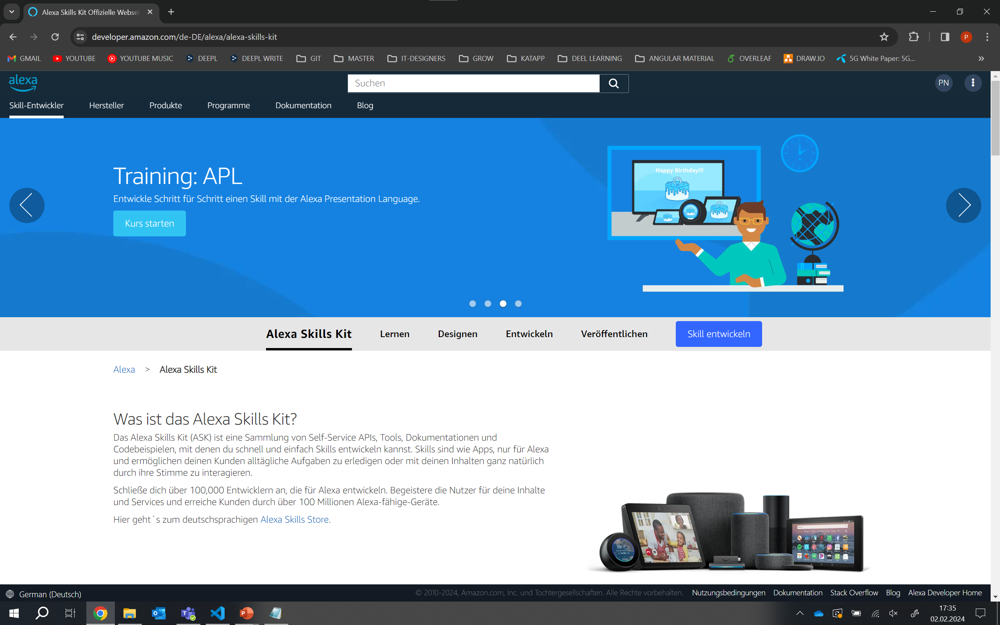
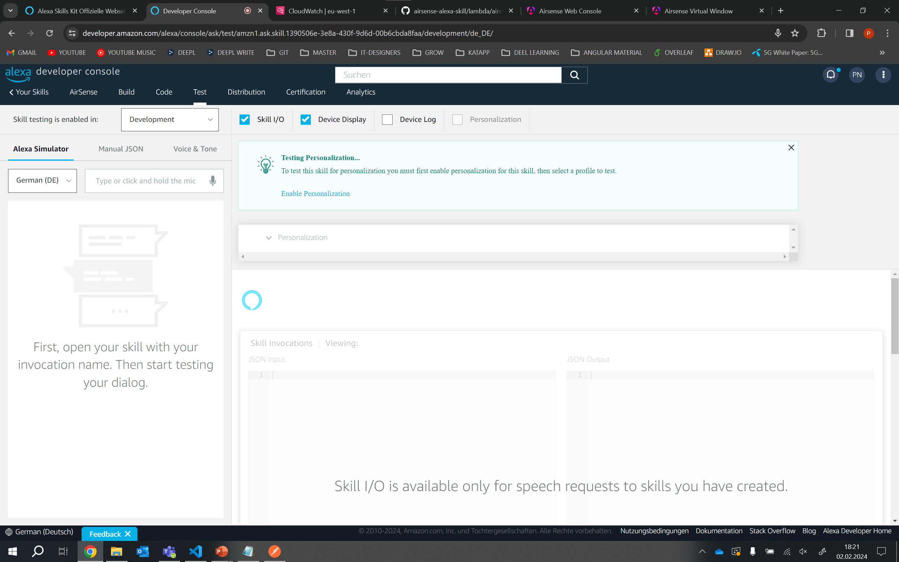

# AirSense Alexa Skill

This repository contains the source code for the Alexa skill for querying the current air quality values.

## Setup

1. Log in [here](https://developer.amazon.com/de-DE/alexa/alexa-skills-kit) with your Amazon account

    

2. In the next step, click on Create skill.

    

3. Give the skill a name and select your desired language.

    

4. In the next step, select the custom model.

    

5. And choose Python as the programming language

    

6. Select the template from scratch.
    

7. Check everything again and click on create skill.
    

8. You should now be on the start page of your skill.
    

9. Paste the code of the [interactionModel.json](interactionModel.json) in the Intents Json Editor and click on build skill. Set your security token instead of "SET YOUR TOKEN HERE". You will receive your token from the backend when you log in.
    

10. Paste the source code from the [lambda](lambda/) folder into the Code tab and click on Deploy.
    

11. Activate the skill for testing on the test page. And you're ready to go.
    