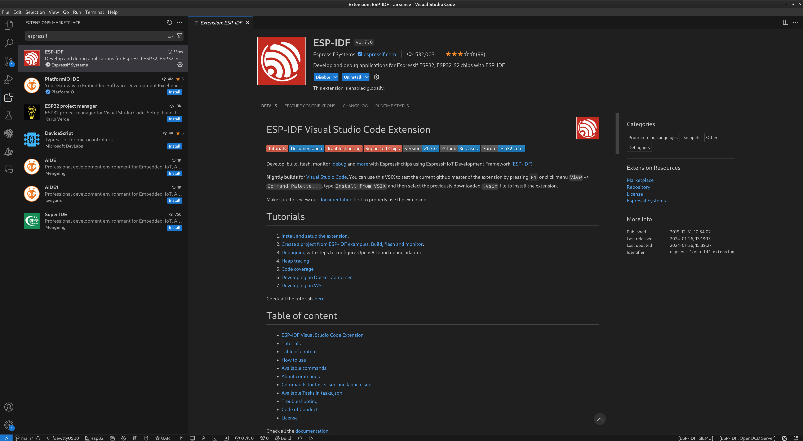
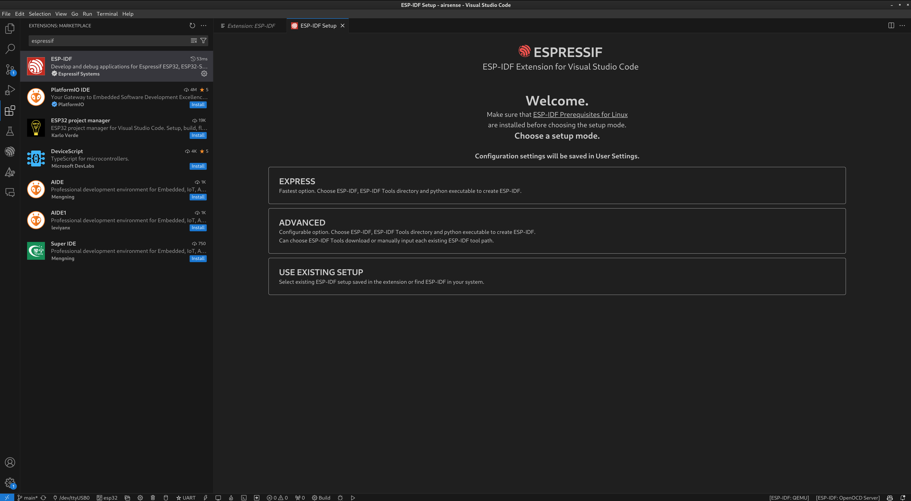
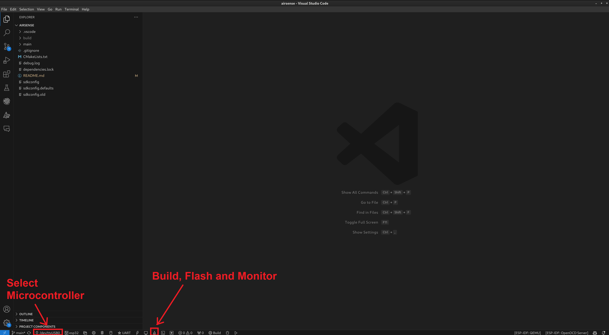

# AirSense Firmware

This repository contains the firmware for the AirSense stations. The firmware can be installed on the base station and external station without modification.

The components and circuit diagrams required for a functional AirSense station can be found [here](https://github.com/airsense-tech/airsense-schematics).

## Installation

We recommend VsCode for building and flashing the firmware. You can download Visual Studio Code [here](https://code.visualstudio.com/).

As we use the [ESP-IDF Framework](https://docs.espressif.com/projects/esp-idf/en/latest/esp32/get-started/) for development, we also need the ESP-IDF Extension.

You can find these in the VsCode Extension Store if you search for "espressif". Then click on Install here.

After the installation, a window will open where you can install the framework. It is best to select "Express" here.

After the installation you can check out our repository.

## Build, Flash and Monitor

If you want to flash a base station, the first step is to copy the images from the [ui_images](./ui_images/) folder to the SD card of the E-Ink display.

Now connect the microcontroller to your PC via USB.

You can select the microcontroller at the bottom left of the bar.

Now all you have to do is click on the flame. The software will then be built automatically, flashed to the microcontroller and the serial terminal opens.

